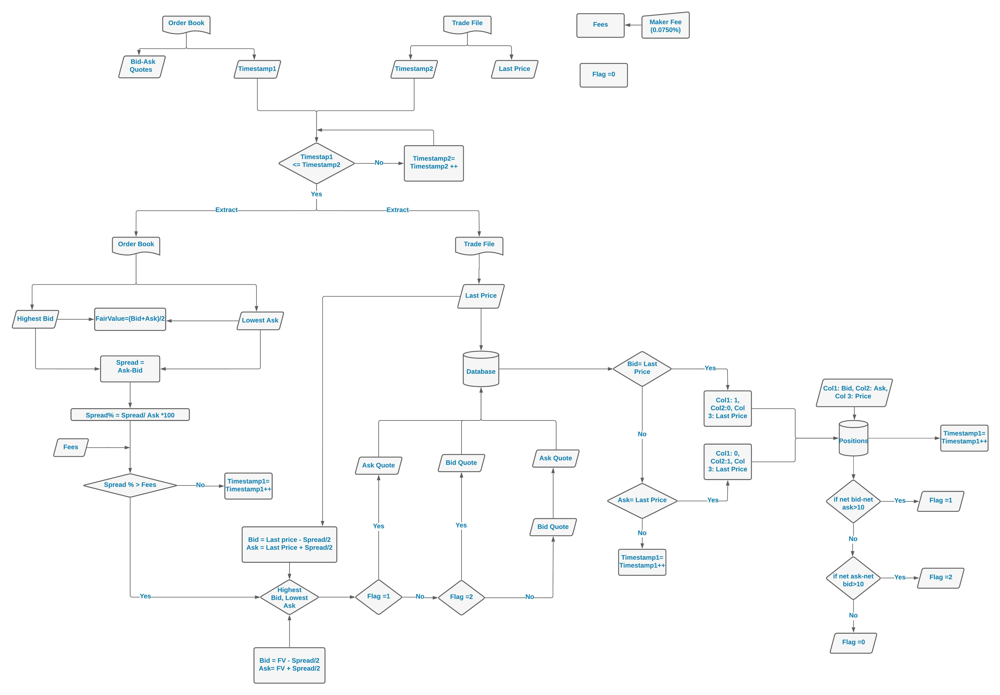

# Crypto Market-Making Trading Algorithm ( Python)

## Overview

This Python script represents a basic crypto market-making trading algorithm. The algorithm aims to profit from the bid-ask spread in the cryptocurrency market. It focuses on the "IOTA/BTC" trading pair on the Binance exchange. Market-making involves providing liquidity to the market by placing buy and sell orders on both sides of the order book. The goal is to profit from the spread between the highest bid price and the lowest ask price while managing risks associated with price fluctuations and inventory.

## Algorithm Breakdown

### Imports and Data Loading

- The algorithm starts by importing necessary libraries, including pandas for data manipulation and json for handling JSON data.
- It loads order book data files named "2020-07-XX.json" and combines them into a DataFrame called "orders."
- Trade data from "trades.csv" is loaded into a DataFrame called "trades," representing past market trades.

### Fair Value Calculation

- For each trade in the "trades" DataFrame, the algorithm calculates the trade's fair value.
- Fair value (fv) is estimated as the average of the highest bid and lowest ask prices in the order book.

### Spread and Spread Percentage

- The spread is the difference between the lowest ask and highest bid prices in the order book.
- Spread percentage is calculated as (spread / lowest ask price) * 100.

### Trading Decision and Position Management

- The algorithm calculates bid and ask prices using fair value and spread information.
- If spread percentage is below specified fees, the algorithm skips the trade due to potential transaction costs.
- Trading positions are managed using a "flag" variable, with values: 0 (neutral), 1 (long), and 2 (short).
- The algorithm decides whether to go long or short based on current position and bid/ask prices.
- The flag is updated based on the relative success of long and short trades for risk management.

### Output and Position Tracking

- Trading positions are tracked using "col0" (bid positions), "col1" (ask positions), and "col2" (trade prices) lists.
- Every 1000 trades, the current positions are saved in a DataFrame named "positions" and exported to a CSV file.

### Final Position Tracking

- Once all trades are processed, a final positions DataFrame is created and exported to "positions.csv."

## Key Concepts

### Fair Value

Fair value refers to the theoretical price at which an asset should trade based on supply and demand. In this algorithm, it's estimated as the midpoint between the highest bid and lowest ask prices.

### Risk Management and Inventory

The algorithm manages risk by adjusting its trading strategy based on net positions. If net positions become too imbalanced (more than 10 positions in one direction), the algorithm changes direction to mitigate risk.

### Adverse Selection

The algorithm avoids trading when the spread is too narrow, mitigating adverse selection where potential gains are eroded by transaction costs.

**Flow Chart of the Algorithm Logic**

